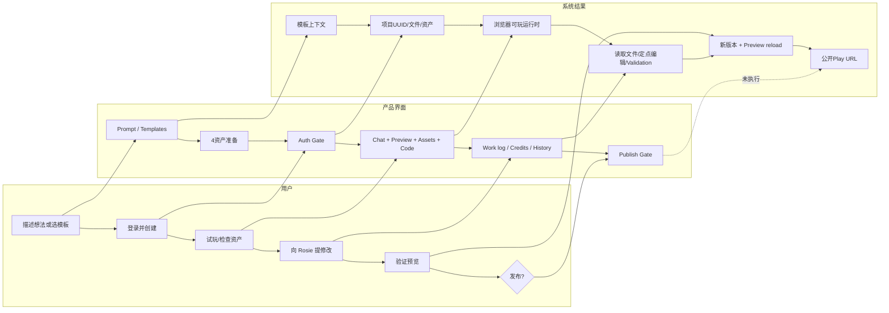

# Rosebud AI｜用户旅程（页面取证版）

## 1. 查看范围

- 匿名首页、模板选择、模板资产准备、登录门；
- 登录后的测试项目创建；
- 编辑器 Chat、Preview、Assets、Code、项目设置、版本历史；
- 1 次 Rosie 局部修改、工作日志、预览验证和额度结果；
- Publish/Share 确认门（未提交）；
- Play 广场与一个公开游戏成品页；
- 官方界面、初学者、发布和定价说明。

## 2. 无法确认项

- 自由文本从零生成项目、图片作为初始输入、资产 Create/Upload；
- Code 的实际手工编辑和导出（当前方案被 Upgrade 门拦截）；
- 发布后的构建、分享、更新、撤回、评论、Remix 和 Tip；
- 工具失败、额度不足、用户中断和版本恢复；
- 协作权限、多人编辑、审计日志、移动端最终发布体验。

## 3. 用户旅程证据表

| 阶段 | 用户目标 | 用户动作 | 页面反馈 | 用户决定 | 页面/资产状态变化 | 问题或阻力 | 证据 |
|---|---|---|---|---|---|---|---|
| 发现 | 快速理解产品 | 打开首页 | `Create Games with AI`；Prompt、图片、模型、Create | 选模板而非自由描述 | 无项目 | 首页同时出现模板和 Prompt，路径选择多但说明少 | E-J-001 |
| 起点选择 | 低成本获得可玩骨架 | 打开模板并选 Interactive Story | 6 个可用模板、3 个 Coming Soon | 继续 | 模板类型写入当前流程 | 不说明模板代码/资产/额度差异 | E-J-002 |
| 资产准备 | 获得匹配模板的视觉资产 | 点击 NEXT | `Preparing your assets...`、4 槽位、0%→Review | 等待 | 生成 1 背景 + 3 角色状态图 | NEXT 立即触发资产准备，无显式费用确认 | E-J-003 |
| 身份门 | 保存和编辑项目 | 点击 CREATE GAME | 登录弹窗 | 登录 | Auth 从匿名变为 Account menu | Google OAuth 在内置浏览器白屏，需邮箱/Microsoft替代 | E-J-004 |
| 建项 | 进入工作台 | 再次创建项目 | `Creating your game`；随后 `/edit/{uuid}` | 等待 | 项目、资产、初始文件、基线版本出现 | 缺少阶段进度、取消、失败恢复 | E-J-005 |
| 初始理解 | 知道下一步做什么 | 查看 Chat | Rosie 欢迎语、3 个建议、自由输入 | 先预览和检查资产 | Chat 从 disabled 变可输入 | Agent ready 与项目 ready 是两个状态 | E-J-006 |
| 试玩 | 判断模板是否可用 | 切到 Preview | 初次黑屏；约 5 秒后可玩场景 | 等待加载 | Runtime 初始化并渲染 | 黑屏没有进度或错误解释 | E-J-007 |
| 资产检查 | 确认资源完整 | 切到 Assets | 4 个 WebP、搜索、上传、Create、路径复制 | 不修改 | 资产引用可见 | 版本/依赖/使用位置不可见 | E-J-008 |
| 代码检查 | 理解实现并手工控制 | 点击 Code | 文件树可见；升级弹窗 | 不升级 | 无修改 | 代码是学习卖点，但免费层立即被锁 | E-J-009/E-A-001 |
| 项目治理 | 查看元数据和来源 | 打开项目设置 | 名称、描述、预览图、Remix 来源、Tips | 不保存 | 只读 | 血缘可见，但版本/授权边界解释弱 | E-J-010 |
| 修改前安全网 | 确认可恢复 | 打开 Version History | `Initial import`、Restore 入口 | 不恢复 | 基线版本可见 | 恢复按钮在未选版本时 disabled，细节未知 | E-J-011 |
| 发起修改 | 做一个可验证小改动 | 输入局部 UI Prompt | 用户消息进入 Chat、出现 Processing | 等待 | Agent run 开始 | 发送前未显示预计 500 credits | E-P-001 |
| Agent 执行 | 让 AI 定位并修改项目 | 无进一步动作 | 列目录→读3文件→改 `index.html` 两次→Validation | 等待 | 文件版本变化 | 完成耗时可见但状态颗粒与取消影响未知 | E-A-002/E-A-003 |
| 完成回复 | 了解结果和成本 | 查看回复 | 修改摘要、4 个 Next moves、500 credits | 不继续生成 | Agent run 完成 | 回复完成早于 Preview 最新变更稳定 | E-J-012/E-J-013 |
| 结果验证 | 确认修改真实生效 | 等待 Preview reload | `Choose your approach` 可见 | 接受结果 | 新 build/运行时加载 | Stats/DC 重载后变化，无法仅凭单次运行证明“不变” | E-J-014/E-J-015 |
| 版本确认 | 观察是否可回退 | 再看 History | 新当前版本 + Initial import | 不恢复 | 自动生成版本条目 | 版本标题与本次小改动不一致 | E-J-016 |
| 发布前检查 | 确认分发边界 | 打开 Publish/Share | Not published；预期 URL；Share 要求先发布 | 停止 | 未发布、无公开链接 | URL 可见不等于已发布；无构建预检摘要 | E-J-018/E-J-019 |
| 内容消费 | 从社区发现成品 | 打开 Play 广场和公开游戏 | 分类、指标、iframe、互动、Remix、推荐 | 不互动 | 只读 | 指标口径、推荐规则、Remix权限未知 | E-J-020/E-J-021 |

## 4. 用户 / 产品界面 / 系统结果三泳道

## 5. 正常、修改、失败、中断与恢复路径

### 正常路径（已确认至发布门）

`模板 → 资产准备 → 登录 → 项目创建 → Preview → Prompt → 工具日志 → Validation → Preview 更新 → 版本记录 → Publish 确认门`

### 修改路径（已确认）

局部自然语言约束 → Rosie 浏览项目 → 读取关联文件 → 两次编辑 `index.html` → 项目校验 → 完成摘要 → 500 credits → 预览刷新 → 标题可见。

### 已出现的失败/阻力

1. Google OAuth 子窗口白屏，导致页面仍为 `SIGN IN`；改用其他登录方式后恢复（E-J-004）。
2. Preview 初次为黑屏，等待后才出现可玩结果（E-J-007）。
3. Code 入口被 Upgrade 门拦截（E-J-009）。
4. Share 在未发布时被 Publish 前置门拦截（E-J-019）。

### 中断与恢复

- Agent 执行时存在 `Stop generation`，但未点击；中断后文件、额度和版本状态未知。
- Version History 有 Restore 入口，但未执行；是否原子回滚代码、资产和 Preview build 未知。
- 发布未执行，因此发布失败/重试/撤回路径未知。

## 6. 情绪、痛点与机会

| 时点 | 可能情绪 | 证据化痛点 | 机会 |
|---|---|---|---|
| 模板启动 | 期待、低门槛 | NEXT 即资产生成，无成本预估 | 在触发前展示资产数、预计 credits、是否复用缓存 |
| 登录 | 中断 | OAuth 弹窗白屏 | 同页邮箱 magic link、错误说明、登录后恢复模板状态 |
| 首次预览 | 怀疑 | 黑屏数秒且无阶段说明 | build/runtime/assets 三段状态和可复制错误 |
| AI 修改 | 有掌控感 | 有工作日志但发送前无成本估算 | 变更计划 + 文件范围 + 预计 credits 确认门 |
| 完成 | 满意但需验证 | Agent 回复先于 Preview 稳定 | 完成条件必须等待 build、validation、runtime smoke test |
| 回滚 | 安心但不确定 | 版本标题偏离改动；恢复语义不明 | 自动 diff 摘要、版本命名、代码/资产/数据回滚范围 |
| 发布 | 临门一脚 | 仅见 URL 和按钮，缺构建/权限摘要 | 发布清单、Remix/可见性/版权/移动端预检 |

## 7. 最值得讨论的问题

1. 为什么一个极小的 UI 文案改动实际消耗 500 credits，而模型提示的常见额度约为 6,000？如何在发送前做可解释估算？
2. Rosie 的完成门应以“文件已写”还是“Validation + Preview 已加载 + 关键 DOM/玩法断言通过”为准？
3. `agents.md` 已承担项目级指导，如何对它做版本、可视化编辑和冲突治理，而不是把重要规则藏在付费 Code 面板？
4. Preview 重载会改变运行时随机 stats，如何区分代码回归和合法随机初始化？
5. 发布、分享、Remix、Tips 与代码隐私如何形成一个用户能理解的权利与商业化模型？
