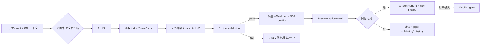

# Rosebud AI｜Agent 契约（页面证据版）

> 本报告只把页面明确命名的 `Rosie` 作为 Agent。资产准备、Preview、Validation、Versioning、Billing 和 Publishing 作为可观察服务/职能，不宣称它们是独立 Agent。

## 1. 产品级 Agent 清单

| Agent / 职能 | 是否命名 | 核心职责 | 触发 | 输出 | 证据等级 |
|---|---|---|---|---|---|
| Rosie AI Coding Assistant | 页面明确命名 | 理解自然语言改动、浏览项目、读写文件、调用校验、总结结果和建议下一步 | 用户 Prompt 或建议按钮 | 文件变更、工作日志、完成摘要、next moves、credits | 已确认 E-J-006/E-A-002/E-A-003 |
| Template Asset Preparation | 中性职能 | 按模板准备 4 个视觉资产 | 模板 NEXT | 背景 + failure/neutral/success 角色图 | 已确认职能 E-J-003/E-J-008 |
| Project Runtime / Preview | 中性职能 | 加载项目构建并在 iframe 中运行 | 建项、刷新、Agent 修改完成 | 可玩画面、DOM、调试/录制/全屏入口 | 已确认职能 E-J-007/E-J-014 |
| Project Validation | 工作日志命名 | 在文件修改后给出通过/失败状态 | Rosie 编辑完成 | `Project validation passed` | 已确认职能 E-A-003 |
| Versioning | 中性职能 | 保存 Initial import 与 Agent 回合版本，支持恢复入口 | 建项、修改完成 | 版本条目、Current、Restore | 已确认职能 E-J-011/E-J-016 |
| Model Router / Billing | 中性职能 | 模型选择、典型成本提示、回合额度结算 | 模型选择、Agent 回合 | 模型标签、成本提示、500 credits 结果 | 已确认职能 E-A-004/E-J-013/E-J-017 |

## 2. Rosie：核心目标与触发条件

### 核心目标

把用户的自然语言游戏修改请求转化为对现有项目文件的最小、可验证变更，并保持项目可运行、结果可预览、变更可追溯。

### 触发条件

- 【已确认】用户在 Chat 输入并提交 Prompt（E-P-001）。
- 【已确认】页面给出项目相关 next-step 建议按钮（E-J-006/E-J-012）。
- 【未知】建议按钮是否跳过确认、是否使用不同 Prompt 模板或成本规则。

## 3. Rosie 输入契约（六类输入）

| 输入项 | 来源类型 | 必填/可选/未知 | 用途 | 等级 | 证据 |
|---|---|---|---|---|---|
| 用户当前 Prompt | 用户当前输入 | 必填 | 定义目标、范围和不变约束 | 已确认 | E-P-001 |
| 图片/截图附件 | 用户当前输入 | 可选 | 提供视觉目标、Bug 现场 | 已确认入口 | E-J-006、E-O-002 |
| 所选模型 | 用户当前选择 | 可选/默认 Rosie | 影响路由、能力和额度 | 已确认 | E-A-004/E-J-017 |
| 项目文件树 | 项目全局上下文 | 必填 | 定位相关文件 | 已确认 | E-J-009/E-A-002 |
| `agents.md` 项目指导 | 项目全局上下文 | 已存在；读取时机未知 | 约束建议和资产策略 | 已确认存在 | E-A-001 |
| 当前 Preview/运行时 | 工具或运行时结果 | 必需于验证 | 检查修改后可见结果 | 已确认表面 | E-J-007/E-J-014 |
| 项目资产及路径 | 用户私有项目资产 | 按任务可选 | 保持或引用既有资产 | 已确认 | E-J-008 |
| 上一轮聊天与工作日志 | 上游 Agent 输出/上下文 | 未知 | 连续修改、避免重复 | 合理推断 | Chat 线程持续显示 |
| 用户长期偏好/跨项目记忆 | 用户长期信息 | 未知 | 未验证 | 未知 | 无页面证据 |
| 平台模板/公共项目 | 平台公共资产 | 建项时必需 | 初始化项目和建议 | 已确认 | E-J-002/E-J-010 |

## 4. 可观察判断

| 判断问题 | 可见行为 | 证据 | 边界 |
|---|---|---|---|
| 请求是否可执行 | Rosie 先承诺“smallest targeted edit”并说明读取计划 | E-A-002 | 未见正式计划确认门 |
| 需要读哪些文件 | 先 Listed `/`，再读 `index.html`、`Game.js`、`main.js` | E-A-002 | 文件选择理由只在自然语言中简述 |
| 是否需要新资产 | 项目 `agents.md` 明确不建议新视觉资产；本次未调用资产生成 | E-A-001/E-A-002 | 对其他模板是否同样适用未知 |
| 修改是否完成 | 两次 Edited `/index.html` | E-A-002 | 没有可见 diff |
| 项目是否通过 | `Project validation passed` | E-A-003 | 校验项未知 |
| 用户可见结果是否完成 | Preview 经 `Loading latest changes…` 后出现新标题 | E-J-014 | Agent 回复先于 Preview 稳定 |
| 成本是否结算 | 回合结束显示 `Credits used: 500` | E-J-013 | 发送前无精确预估 |
| 是否继续 | 生成 4 个项目相关 next moves | E-J-012 | 建议点击成本和范围未知 |

## 5. 工具契约

| 功能名 | 调用者 | 前置条件 | 可见参数/对象 | 执行证据 | 成功/失败 | 幂等 | 状态写入 |
|---|---|---|---|---|---|---|---|
| `<列目录工具>` | Rosie | 项目存在 | `/` | Listed directory `/` | 成功 | 未知 | 仅工作日志 |
| `<读取项目文件工具>` | Rosie | 已定位文件 | `/index.html`、`/scenes/Game.js`、`/main.js` | 3 次 Read | 成功 | 读取应幂等（推断） | 上下文缓存未知 |
| `<编辑项目文件工具>` | Rosie | 目标与插入点确定 | `/index.html` | 2 次 Edited | 成功 | 未知；重复可能重复插入 | 文件版本更新 |
| `<项目校验工具>` | Rosie/Validator | 文件写入完成 | 项目当前版本 | `Project validation passed` | 成功 | 未知 | 校验状态可见 |
| `<Preview 构建/刷新工具>` | Runtime | 新文件版本 | 当前项目 | Loading latest changes→iframe | 成功 | 刷新可重复；状态随机 | Preview build/runtime |
| `<版本记录工具>` | Versioning | Agent 回合完成 | 文件状态/摘要 | 新 Current 版本条目 | 成功 | 未知 | Version history |
| `<额度结算工具>` | Billing | 回合结束 | 模型/复杂度/工具使用 | 500 credits | 成功 | 重复请求防重未知 | Credit ledger |

## 6. 输出契约（五类输出）

| 输出项 | 类型 | 消费者 | 等级 | 证据 |
|---|---|---|---|---|
| 执行计划和过程说明 | 自然语言 | 用户 | 已确认 | E-A-002 |
| Work log 7 steps | 页面组件 | 用户/审计 | 已确认 | E-J-012/E-A-002 |
| 修改后的 `index.html` | 资产/状态 | Runtime、Versioning | 已确认 | E-A-002 |
| `Project validation passed` | 结构化状态 | Agent 完成门/用户 | 已确认 | E-A-003 |
| `Choose your approach` | 可见页面组件 | 玩家 | 已确认 | E-J-014 |
| 完成摘要 | 自然语言 | 用户 | 已确认 | E-J-012 |
| 4 个 Next moves | 下游任务候选 | 下一轮 Rosie | 已确认 | E-J-012 |
| 500 credits | 结构化字段/账本结果 | 用户/Billing | 已确认 | E-J-013 |
| 新版本条目 | 资产/状态 | Versioning/Restore | 已确认 | E-J-016 |

## 7. 上下文读写表

| 对象 | 读/写 | 生产者 | 消费者 | 更新时机 | 版本 | 失效依赖 | 等级/证据 |
|---|---|---|---|---|---|---|---|
| UserPrompt | 读 | 用户 | Rosie | Submit | Chat turn | 新 Prompt | 已确认 E-P-001 |
| ProjectGuidance (`agents.md`) | 读（本次是否读未知） | 模板/项目 | Rosie suggestions | 项目创建/手工修改 | 文件版本 | 指导文件变更 | 存在已确认 E-A-001 |
| ProjectFileTree | 读 | Project Store | Rosie/Code UI | Agent 开始 | 当前项目版本 | 新增/删除/重命名 | 已确认 E-A-002 |
| ProjectFiles | 读/写 | 模板/用户/Rosie | Runtime/Versioning | Edit | 新版本 | 后续编辑/恢复 | 已确认 E-A-002 |
| AssetManifest | 读 | 资产准备 | Runtime/Rosie | 建项/资产变更 | 未知 | 资产覆盖/删除 | 已确认 E-J-008 |
| WorkLog | 写 | Rosie/tool layer | 用户/审计 | 每个工具动作 | Agent run | 日志保留期未知 | 已确认 E-J-012 |
| ValidationResult | 写 | Validator | Rosie/用户 | 编辑后 | Agent run | 文件变化 | 已确认 E-A-003 |
| PreviewBuild | 写/读 | Runtime | 用户/QA | 初始或文件变更 | build 未见ID | 文件/资产变化 | 已确认 E-J-007/E-J-014 |
| VersionHistory | 写/读 | Versioning | 用户/Restore | 建项与回合完成 | 条目级 | 恢复/新回合 | 已确认 E-J-011/E-J-016 |
| CreditUsage | 写/读 | Billing | 用户/Plan | 回合结束 | ledger 未见ID | 退款/调整未知 | 已确认 E-J-013 |

## 8. 完成条件

### 当前可观察完成条件

1. Rosie 不再显示 Stop generation；
2. 工作日志显示文件编辑动作；
3. `Project validation passed`；
4. 完成摘要和 credits 出现；
5. Preview 完成 `Loading latest changes…`；
6. 用户目标文本在 iframe 中可见；
7. Version History 产生新 Current 条目。

### 当前完成门缺口

- 没有可见 diff、测试列表、Preview build ID 或幂等请求 ID；
- “保持 stats 不变”因运行时随机化无法直接验证；
- Agent 回复完成和 Preview 稳定之间存在时间窗；
- 版本标题与真实改动摘要不一致。

## 9. 异常重试、下游交接与未知

- 执行中可 `Stop generation`，但中断后是否结算 credits、回滚半成品未知。
- Project validation 失败后的自动修复、最大重试和用户确认门未知。
- Preview 黑屏时可刷新/看 debug console，但未验证错误内容和自动关联到 Rosie 的方式。
- 下游交接包括 Runtime、Versioning、Billing 和 Publishing；接口字段与事务边界未知。
- 发布必须在独立确认门完成；Share 明确依赖 Publish。

## 10. 输入—判断—工具—输出—交接图

