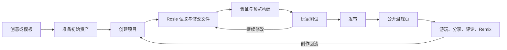
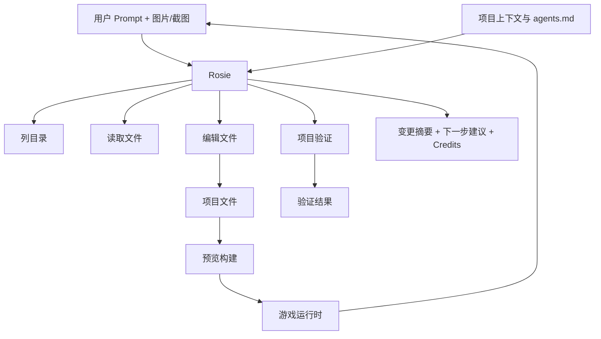
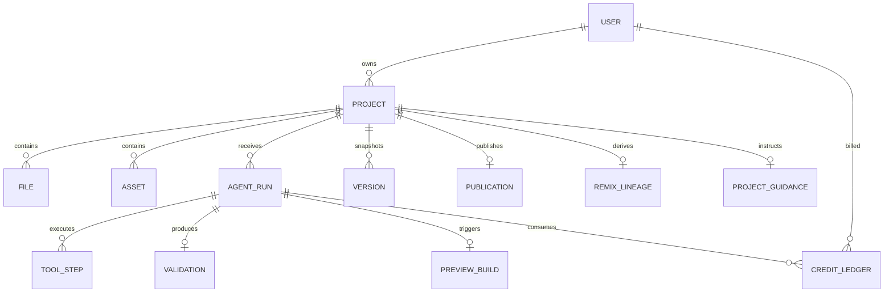
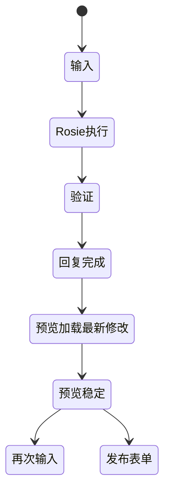
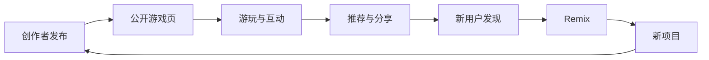

# Rosebud AI｜产品全景架构（证据分层版）

> 取证日期：2026-08-19｜目标：`develop.play.rosebud.ai`｜结论不等于官方内部实现。

## 1. 一句话结论

Rosebud AI 不是单一的“文本生成游戏”工具，而是一个由 **AI 编码编排器（Rosie）+ 项目文件工作区 + 资产与运行时预览 + 版本/额度系统 + 发布与社区分发**组成的端到端 AI 游戏生产平台。

证据等级：

- **已确认**：页面、交互、公开文档或本次真实操作直接可见。
- **推断**：为了让已确认行为成立而提出的最小系统假设。
- **建议**：目标架构与产品优化，不代表现状。

## 2. 核心价值闭环

已确认的产品闭环是“创作—修改—预览—发布—游玩/Remix”。社区不只是展示层，也承担模板发现、作品分发与再创作入口。

## 3. 端到端用户旅程

| 阶段 | 用户行为 | 系统反馈 | 关键证据 | 判断 |
|---|---|---|---|---|
| 发现 | 从 Create 或 Play 进入 | 创意输入、模板与公开游戏 | S01、S02 | 已确认 |
| 初始化 | 选择 Interactive Story 并继续 | 在最终创建前即开始准备 4 个资产 | S03、S04 | 已确认 |
| 身份 | 点击创建 | Google、Microsoft、Email 登录与条款勾选 | S06 | 已确认 |
| 建项 | 登录后继续 | 创建项目并进入稳定 `/edit/{uuid}` | S07、S08 | 已确认 |
| 工作台 | 查看 Chat/Preview/Assets/Code | Rosie、预览、资产库与代码入口同处一页 | S09–S13 | 已确认 |
| 修改 | 提交小范围 Prompt | Rosie 列目录、读文件、改文件、验证并回复 | S16、S18、S20 | 已确认 |
| 验收 | 查看预览 | 先显示“加载最新修改”，随后出现目标标题 | S19、S19a | 已确认 |
| 留痕 | 查看历史与额度 | 新版本记录；本次消耗 500 credits | S21、S22 | 已确认 |
| 发布 | 打开 Publish/Share | 发布表单；未发布前没有分享链接 | S23、S24 | 已确认 |
| 分发 | 浏览公开作品 | 游玩、点赞、评论、Remix、Tip、Share | S05 | 已确认 |

关键发现：模板的资产准备发生在用户最终确认创建之前；AI 回复完成与预览稳定并非同一时刻；一次低范围文本修改实测消耗 500 credits，而 Rosie 模型提示“通常约 6,000 credits，随复杂度变化”。

## 4. 九层产品全景架构

| 层级 | 组成 | 证据层级 | 说明 |
|---|---|---|---|
| L1 用户与渠道 | 匿名访客、登录创作者、玩家、Remixer；Create、Play、公开 URL | 已确认 | 同一平台连接生产侧与消费侧 |
| L2 交互工作台 | 首页 Prompt、模板向导、Chat、Preview、Assets、Code、设置、历史、发布/分享 | 已确认 | 创作入口和调试入口集中在编辑器 |
| L3 产品应用 | 游戏生成、AI 编码工作区、资产管理、运行时预览、公开游戏页、社区发现 | 已确认 | 多应用拼成完整创作与分发闭环 |
| L4 Agent 编排 | Rosie、执行步骤、建议下一步；可能存在运行协调器 | Rosie 已确认；协调器推断 | Rosie 是唯一页面直接命名的 Agent |
| L5 工具与服务 | 列目录、读文件、编辑文件、项目验证、预览构建、资产、版本、额度、发布 | 前 4 项已确认；服务边界推断 | 页面日志证明 Rosie 有受控项目工具调用 |
| L6 模型网关 | Rosie、Claude、Gemini、GPT、Grok 选择器；额度计量 | 模型列表已确认；实际路由未知 | UI 暴露模型选择，但不能证明底层供应商调用方式 |
| L7 上下文与数据 | 用户、项目、指导、文件、资产、AgentRun、工具步骤、验证、构建、版本、额度、发布 | 实体存在多为已确认；字段关系推断 | 需要跨 Agent、预览、版本和发布保持一致性 |
| L8 模板与知识资产 | 模板、社区作品、项目 `agents.md`、初始代码、初始视觉资产、分类元数据 | 已确认 | `agents.md` 是项目指导内容，不等于官方系统 Prompt |
| L9 基础设施与治理 | Auth、浏览器 iframe、托管/CDN、支付/套餐、日志/队列/监控、版权与 Remix 权限 | 部分已确认；内部设施推断 | 代码访问、商业权利、发布与 Remix 均有治理需求 |

## 5. Rosie Agent 的可见执行契约

本次真实任务中，Rosie 进行了 7 个可见步骤：列出根目录，读取 `index.html`、`scenes/Game.js`、`main.js`，两次编辑 `index.html`，最后通过项目验证。任务目标是仅增加“Choose your approach”标题，并保持现有视觉、属性、对话和逻辑不变。

不能确认的内容：Rosie 的官方系统 Prompt、内部思维链、实际模型路由、隐藏工具参数、验证器实现、是否存在未显示的工具调用。

## 6. 关键数据实体与关系

建议最小字段：

- `AgentRun`: run_id、project_id、prompt、model_option、state、started_at、completed_at。
- `ToolStep`: step_id、run_id、tool、input_digest、output_digest、status、duration。
- `PreviewBuild`: build_id、run_id、version_id、state、runtime_url、validation_receipt。
- `Version`: version_id、parent_version_id、title、diff_summary、created_by_run_id。
- `CreditLedger`: ledger_id、run_id、reserved、actual、refunded、unit、pricing_snapshot。
- `Publication`: publication_id、project_id、build_id、slug、visibility、remix_enabled、rights_attestation。

以上字段为目标设计建议，不代表页面已经证明其真实数据库结构。

## 7. 状态机与完成语义

### As-Is 可见状态

“Rosie 已回复”早于“预览已稳定”，所以页面的完成语义实际至少包含两个完成点：Agent 完成和 Runtime 完成。如果 UI 只强调前者，用户容易在黑屏或旧构建阶段误判结果。

### To-Be 建议状态

`waiting_input → planning → awaiting_confirmation（高风险时）→ executing → validating → previewing → completed / failed / handoff`

只有在变更写入、验证通过、预览构建成功且关键断言成立后，才应进入 `completed`。如果构建失败，应保留上一个可运行版本并提供重试、回滚或人工接管。

## 8. 额度与模型路由

页面公开了多个模型选项：Rosie、Claude Sonnet/Opus、Gemini Pro/Flash、GPT Terra/Sol、GPT-5.6 Luna、Grok 4.5。Rosie 提示“通常约 6,000 credits”，但本次小改动实测为 500 credits。

可确认的是“选择器与额度计量存在”；不能确认所选名称是否直接一对一对应供应商模型、是否使用自动路由、缓存、降级或混合调用。

建议增加：提交前展示预计区间（最小/常见/上限）、运行中额度预留、完成后按工具步骤归因、失败自动退款或明确不退款规则。

## 9. 文件、资产与运行时

- 可见项目树包含 `scenes/Boot.js`、`scenes/Game.js`、`systems/DialogueSystem.js`、`agents.md`、`index.html`、`main.js`、`manifest.js`。
- Assets 中可见 4 个 WebP：背景与失败/中性/成功角色图；支持搜索、上传、Create 与复制路径。
- Code 页面在当前套餐触发升级门槛，但 DOM 仍展示文件树和部分 `agents.md` 内容。
- Preview 通过嵌入式运行时呈现，并提供刷新、调试控制台、录制、全屏。

推断：项目文件和资产通过路径绑定，预览服务基于某一版本或工作区快照构建运行时。内部构建器、沙箱、CDN 和缓存策略没有页面证据。

## 10. 发布、社区与增长回路

发布表单允许设置名称、描述、分类等元数据；未发布前 Share 明确提示先发布。公开游戏页承载游玩、点赞、评论、Remix、Tip、Share、作者和推荐内容。

这形成内容供给、玩家消费、Remix 再创作的增长回路。风险集中在版权、冒用、违规内容、指标刷量、Remix 权利边界和发布撤回能力。

## 11. 主要问题与风险

| 优先级 | 问题 | 证据/冲突 | 影响 |
|---|---|---|---|
| P0 | Agent 完成与预览稳定不同步 | S18 后仍出现“Loading latest changes” | 用户误判成功，可能重复提交 |
| P0 | 发布与 Remix 权利治理 | 公开页提供 Remix、Tip、Share；模板含知名 IP 风格内容 | 版权、商用和内容安全风险 |
| P1 | 额度预估不透明 | Rosie 通常约 6,000；本次实测 500 | 难以控制成本和比较模型 |
| P1 | 最终确认前启动资产准备 | 点击 NEXT 即出现资产生成进度 | 计算成本和用户意图不完全对齐 |
| P1 | 变更证明不足 | Rosie 称逻辑/属性不变，但重载后可见数值变化 | 用户难区分代码改变与运行时随机性 |
| P1 | 版本标题与实际修改不一致 | 历史标题为“Glam-Fee Showdown”，实际为小标题 | 检索、回滚与审计困难 |
| P1 | 项目指导与指令注入 | `agents.md` 对 Agent 行为施加约束 | 外部/Remix 项目可能污染 Agent 上下文 |
| P2 | 登录弹窗兼容性 | Google OAuth 在本次内置浏览器出现空白 | 创建漏斗中断 |
| P2 | Code 权限门槛与学习价值张力 | 文件树可见，但代码访问要求升级 | 教学、调试和信任受限 |

## 12. To-Be 目标架构

1. **统一 AgentRun 状态机**：Agent 回复、验证、构建和预览必须挂在同一个 `run_id` 下。
2. **提交前成本预检**：展示模型、预计 credits 区间、计划读取/修改范围；超过阈值再次确认。
3. **差异化变更确认**：在写入前或完成后提供 affected files、代码 diff、不可变契约和回滚点。
4. **验证凭证**：验证器输出机器可读 receipt；对界面任务增加 DOM、截图或试玩断言。
5. **稳定预览门槛**：以 `PreviewBuild` 状态决定最终完成，旧构建继续可用，失败可重试/回滚。
6. **确定性测试**：为随机属性提供 seed 与回归模式，避免把随机变化误判为逻辑回归。
7. **可信版本记录**：版本标题由 diff 和 Prompt 联合生成，并显示父版本、影响文件与验证结果。
8. **资产依赖图**：记录代码—资产引用，按依赖做局部失效和构建，减少无关重算。
9. **发布检查表**：发布前确认权利、可见性、Remix 开关、移动端、内容安全、构建版本与撤回策略。
10. **全链路可追踪**：Project、Run、ToolStep、Version、Build、Credit 和 Publication 建立可查询关联与幂等键。

## 13. 证据冲突与未知项

- “保持 stats 不变”与预览重载后数值变化同时存在；缺少代码 diff 和随机 seed，结论只能标注为未判定。
- 版本标题与实际 Prompt 不相符，未知是模板遗留、自动摘要错误还是产品 Bug。
- 页面展示模型名称，不等于确认实际 API 供应商、具体版本或每次路由。
- `agents.md` 可见片段是项目级指导，不能视为 Rosie 官方系统 Prompt。
- 看不到队列、构建器、数据库、对象存储、CDN、监控、审计实现；架构图中这些均是合理推断或建议。
- 未执行最终 Publish、Share、Remix、Tip、购买、升级、删除和版本恢复，因此不对这些写操作的完成态做事实声称。

## 14. 证据入口

- 详细页面证据：`evidence/evidence-ledger.md`
- 用户旅程：`01-用户旅程-页面取证版.md`
- Agent 契约：`02-Agent契约-页面证据版.md`
- 功能等价 Prompt：`03-目标Agent-功能等价SystemPrompt.md`
- 截图：`evidence/screenshots/`
- 官方公开资料：Rosebud 首页、Interface Guide、Beginner Guide、Pricing FAQ、发布/嵌入相关官方文章。

本拆解只主张可复核的产品行为与最小必要推断；不声称获得内部源码、数据库结构、思维链或官方系统 Prompt。
